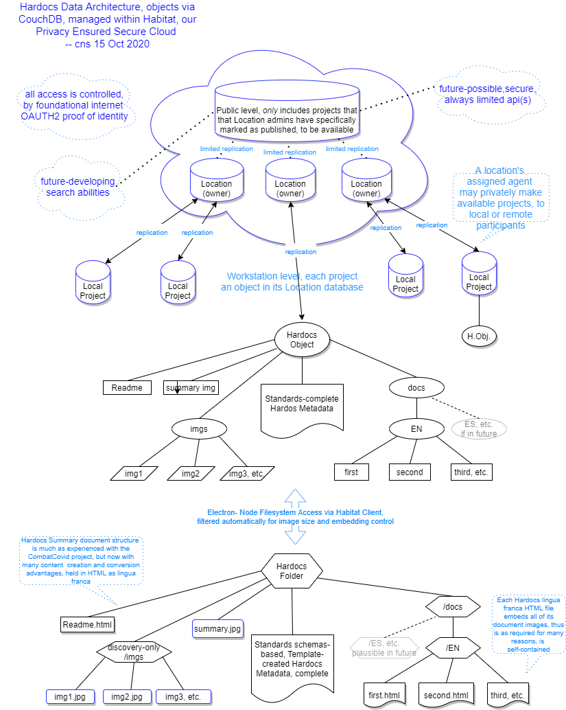

# Architectural design

We've mentioned some of the driving goals for the Hardocs Architecture in the Design Premises, so this should be a place to describe some aspects of how they are implemented.

A diagram can be a good way to visualize, and understand location for points of interest we'll talk about. Let's start with this outline of the architecture's data flows.

## The Hardocs Data Object

We're interested in a unified package of data for each design project Hardocs engages with, and a formal data object gives us a nice way to obtain this.

You can see the content types our design carries, which are attuned to **FAIR** and **OPEN** sharing, with best support at this level for enabling effective **co-creative** discovery and sharing.

### Visible project documentation

We support summary documentation, which can be composed via the Hardocs editor as a sensible introduction to any of the myriad forms and resources a project may likely have in their full repository or files.

This reduction is entirely necessary as our calculations of data transfers show; while it is also a formidable way to get a project's presentation into a view where others can find and discover about it.

We anticipate a variety of methods possible for discovery, not to exclude a rapid-fire and highly visual application in some future, which would present much as the CombatCovid Finder-Viewer web app does. Interesting forms of text search are also possible to develop, on a menu.

### Visible object format and content

Besides familiar formatted text, mages and drawings much as in this Hardocs website can be included, and will be automatically sized and handled as it's brought into the object. This will save a lot of effort from being necessary on typical camera images, for example, and gives the protection we require on absolute data size.

Text and images are brought together in our 'lingua franca', which encapsulates both in a single-file form of HTML. A file for each document is always written  into files on the workstation, at the side of their internal database-capable object we operate Hardocs with, providing an automatic backup against any form of unexpected loss.

### Hardocs Metadata content

The third form of the Hardocs Object information is the JSON metadata. It is essential in describing the project according to standards, which especially enable forms of machine-enhanced discovery.

We provide some very thoughtful abilities in the Hardocs editor for this metadata, using easy-entry graphics forms where items and composites are chosen readily from Templates, as well as composable at any time individually.

One doesn't deal then with syntax and computer coding; rather with simple items where names, types, and information is simply formed.

Hardocs handles all the internal matters, and incorporates the resulting metadata with its Data Object, giving that unified element we can manipulate, share, display, and discover.

## Where does the data go? Databases, and the Workstation

Referring again to our diagram, you can see that once Hardocs Data Objects are formed, they begin to travel, upwards in the picture.

As mentioned in other discussion, there's a flexibility in this, due to the architecture's careful boundaries of services and interfaces, but we'll discuss the powerful basis we're working with at present, which is based on the abilities of the *document* (as distinguished from SQL) database, Apache CoudhDb.

CouchDB is a seasoned player of the variety now very important to the internet, and it is well appreciated for its very notably reliable abilities in managing and protecting data. That it does this so well over a sharing with connectable sibings called *replication* is no doubt a good reason for even IBM to have organized a services offering around it.

On careful scrutiny, we use the same capabilities to our advantage in several important ways -- and they also give sound support to the idea that this Hardocs architecture has full capabilities to grow in size scale, and in geographical distribution wherever that can give best service in the internet-connective world.

### The workstation-local database

CouchDB as a document database is always convenient to work with data objects which can come in many shapes and arrangements, as when you consider metadata especially, ours certainly can.

The first port of call for our unified object is with a workstation-level implementation of CouchDB, called PouchDB, perhaps for the idea that it operates the same, but fits in a 'pocket'. We enable this 'pocket' with a facet our Habitat Client which is kept very simple: the object can be read or stored; and it can also be replicated, which means a two-way connection with the greater world.

That outer world is very much mediated by the protection of our security design, which keeps projects accessible only to assigned members in their own 'location', which we can often see is their design practice or laboratory.

Futures will bring availability of the choice to 'publish', which will never be enabled unless by decision of a locally responsible adminstrator. This means default operation is always private.

On the other hand, the development of a public face for those who can use it is the road that wider-than-local **OPEN** and **FAIR** access become available, and thus a much wider field of co-use and **co-creation** -- if those can also be done on a more limited local scale through Hardocs.

This publicly possible face is in the architectural design most definitely, as in the wider goals of Hardoocs, so we'll move one more step up on the diagram, and to a brief discussion of how that extension is enabled to happen.

## The larger Hardocs: the Habitat Cloud

We've given the ability to *operate* the cloud for both Hardocs projects and their administration, through that portion of the Habitat Client, its 'API', always on a need-to-have-permission basis.

What these operations accomplish, is sketched within the top, cloudy portion of the diagram.

- One can notice immediately that each 'location' has its own database, which manages all of its projects, the Hardocs data objects for each of them, and especially their permissions.

    This is a very sound and recommended way to deploy CouchDB, not least because it bounds the resource requirements for each owning entity, our 'location'; also in other ways that enable the reliable replication. And yes, it's very different from older ways, as many things are for the advantages of document databases.

- How did the workstation Hardocs project's object data get there? Via the slender, two-direction arrows, which is our first use and example of replication.

    Replication is a two-way street, which is why the arrows between projects and the cloud have two directions. Replication means matching data contents *between* two data locations. There are a number of implications of this, and some of them are to be dealt with in well-understood ways for a full Hardocs implementation, but the fundamental power is that information can be worked on from more than one person or workstation.

    When we speak about **co-creative** work in all scales, it's easy to see how important reliably managed replication will be to it. A powerful example is the co-editing ability of Google Docs, where in a truly instant way we won't need to attempt to provide, two persons can work on the same project together.

    To close, then, we use replication as in the two-way arrows, to move local workstation project databases into the cloud, unifying their information with what may be already there -- and at the same time are able to bring any project's cloud content for the project down, so that work of others can be incorporated.

### For further discovery and sharing: the Public Level

Finally we arrive at the top of our diagram. There is a database that is physically larger, as indeed it would be in a working full Hardocs.

We can see replication is operating, with the note that it is limited.  This is the implementation of the protected ability to widely share, invite **co-creation** in its broadest **FAIR** and **OPEN** concepts.

In another pattern recommended for the CouchDB database, we use replication internally, to copy Projects, only those that have been marked published, from their individual Location databases, and into a single Public resource.

This Public level is where wide search and discovery can take place, and there are a variety of means potential for this, in the future for a popular Hardocs.

We won't get into them here, but architectural consideration has been open both to visually orientated Finders as in the CombatCovide effort, and more machine-orientated (necessarily thoughtfully worked-out) methods that may delve more deeply into project metadata and possibly freer discovery of text.

These are substantial projects to become involved with, at the same time as their potential value is clear, and what we've provided in the Hardocs architecture should be open to processes and possible connections for many of them.

## In summary

This discussion has covered an amount of territory, and yet not gotten into the level of thinking and researching activity's own discovery that's gone into many of the details in what we are delivering as an Alpha Hardocs.

It should be clear that the design is substantial, and in every intention of being clear-sighted into futures:  we would like Hardocs to bring its potential into the intuitions and the desires that have motivated its initial sponsorshop.

Implementing, and along the way refining and re-focusing each aspect of attractive possibility will not be a small thing, but that now well-appreciated form of reflective design and development, its own form of **co-creation**, should lead in many rewarding paths. Our hope, and for all who may become involved, certainly.
